<div align="center">


# pkpass Quick Look

**Peek inside Apple Wallet, Google Wallet & Samsung Wallet passes from Finder — just hit the Space bar.**


</div>

A `.pkpass` file is just a zipped-up Apple Wallet pass — a boarding pass, a coffee loyalty card, a concert ticket. macOS has no idea how to show you one without opening Wallet or unzipping it by hand. This fixes that — and throws in Google and Samsung wallet passes for good measure.

Select a pass in Finder, press <kbd>Space</kbd>, and you get a proper Wallet-style card: the right colours, the logo, every field group, a scan-quality barcode, the small print on the back, a listing of everything inside the file, and the raw JSON if you want to poke around. Finder shows a card thumbnail for it too. Everything is rendered on your Mac — **no network calls, ever.**

> 🎬 **See it move:** the card below is a live animated SVG (it plays right here on GitHub). For the full thing — Lottie, Rive, and a WebGPU shader running in the browser — open the **[live demo page](https://ariomoniri.github.io/ql-pkpass/)**.

<div align="center">



</div>

---

## ⚡ Install

You'll need macOS 13 or newer and Xcode (it ships the build tools). *(The Quick Look extensions themselves run on macOS 12+; the menu-bar helper app needs 13.)* Then:

```bash
git clone https://github.com/ArioMoniri/ql-pkpass.git
cd ql-pkpass
make install
```

That builds the app, drops it in `/Applications`, registers and **enables** the Quick Look extensions, and refreshes Quick Look. Now click any `.pkpass` in Finder and tap <kbd>Space</kbd>.

Try it immediately with the bundled sample:

```bash
open examples/Skyline-BoardingPass.pkpass   # or select it in Finder and press Space
```

<details>
<summary>🔧 Prefer to do it by hand (or no <code>make</code>)?</summary>

<br>

```bash
# Build a Release copy (ad-hoc signed, no Apple account needed)
xcodebuild build -scheme PkpassQuickLook -configuration Release \
  -derivedDataPath build CODE_SIGN_IDENTITY="-"

# Move it into place and register + enable the extensions
cp -R build/Build/Products/Release/PkpassQuickLook.app /Applications/
/System/Library/Frameworks/CoreServices.framework/Frameworks/LaunchServices.framework/Support/lsregister -f /Applications/PkpassQuickLook.app
pluginkit -e use -i com.ariomoniri.PkpassQuickLook.Preview
pluginkit -e use -i com.ariomoniri.PkpassQuickLook.Thumbnail
qlmanage -r && qlmanage -r cache
```

Or just open `PkpassQuickLook.xcodeproj` in Xcode and run it once.

</details>

<details>
<summary>🧹 Uninstall</summary>

<br>

```bash
make uninstall      # removes the app and refreshes Quick Look
```

</details>

---

## 👀 What you'll see

The preview adapts to whatever style the pass declares — boarding pass, event ticket, coupon, store card, or generic — and renders it at its real proportions (no squished square).

| In the preview | What you get |
| --- | --- |
| 🎨 **Brand colours** | The pass's own `backgroundColor` / `foregroundColor` / `labelColor`, the way Wallet renders them |
| 🏷️ **Logo & organization** | The logo image (or `logoText`) plus the organization name |
| 👁️ **Glance in Finder** | The preview pane shows the card before you even press Space |
| 🧾 **Every field group** | Header, primary, secondary, auxiliary, and back fields — laid out like the real card |
| ✈️ **Boarding passes** | Big origin → destination with the right transit icon |
| 🔳 **Barcode** | Re-rendered from the pass at **scan-quality** resolution, keeping each symbology's true shape — QR, PDF417, Aztec, Code 128 |
| 🗂️ **File listing** | Every file inside the archive with its size |
| 🧩 **Raw JSON** | The full `pass.json` (or Google/Samsung JSON) for inspection |
| 📄 **Export to PDF** | Open the app's viewer and save any pass as a PDF |

---

## 🌍 Apple, Google & Samsung

| Wallet | File it reads | How to preview it |
| --- | --- | --- |
| 🍎 **Apple Wallet** | `.pkpass` (a signed ZIP) | Works out of the box — Space-bar in Finder |
| 🟢 **Google Wallet** | the JSON of a "Save to Google Wallet" JWT payload (or a raw JWT) | Open it in the app, **or** name it `.gwallet` / `.gpass` to Space-bar it |
| 🔵 **Samsung Wallet** | the documented "Wallet Card" JSON (`{ "card": { … } }`) | Open it in the app, **or** name it `.swcard` / `.samsungpass` to Space-bar it |

<details>
<summary>Why Google/Samsung need a rename (the honest version)</summary>

<br>

Neither Google nor Samsung ships a real downloadable pass file like Apple's `.pkpass`. Google passes travel as a **"Save to Google Wallet" JWT**; Samsung passes travel as an **encrypted token only Samsung can read**. The closest human-readable artifact in both cases is the **JSON** the issuer builds before signing/encrypting.

So this plugin renders that JSON. macOS can only route a file to a Quick Look extension by its type, and a plain `.json` would be far too broad to claim — so the plugin declares its own file types (`.gwallet`, `.gpass`, `.swcard`, `.samsungpass`). Drop your pass JSON under one of those extensions and Space-bar works; or just use **Open a pass…** in the app, which takes any file.

Google and Samsung images are remote URLs (not embedded like Apple's), so a sandboxed preview renders colours, text and the locally-drawn barcode — never reaching out to the network.

</details>

---

## 🧠 How it actually works

<details>
<summary>The short version</summary>

<br>

Old-school `.qlgenerator` plugins are dead on modern macOS. This is a **modern Quick Look App Extension** — two of them, bundled inside a tiny host app:

- **`PkpassPreviewExtension`** — a data-based `QLPreviewProvider` that returns a self-contained HTML card (images and barcode inlined as base64, so nothing is fetched).
- **`PkpassThumbnailExtension`** — a `QLThumbnailProvider` that draws the Finder thumbnail.

Both talk to **`PkpassKit`**, a dependency-free Swift framework that does the real work.

</details>

<details>
<summary>Three things that will silently break a pkpass Quick Look plugin 🪤</summary>

<br>

Hard-won on macOS 26 — saving you the afternoons:

1. **The UTI isn't what you'd guess.** `com.apple.pkpass` is the *package* type; an actual file on disk is **`com.apple.pkpass-data`** (conforms to `public.data`). Register the wrong one and the extension installs fine and then never fires.
2. **Data-based previews need a flag.** A `QLPreviewProvider` that returns data must set **`QLIsDataBasedPreview = true`** in its Info.plist, or Quick Look treats it as view-based, waits for a view that never comes, and spins forever.
3. **No GPU in the sandbox.** Forcing a GPU `CIContext` (or WebGPU) inside the preview extension stalls on Metal init. Barcodes are rendered on the **CPU**; WebGPU is confined to the demo page.

</details>

<details>
<summary>Why there's a hand-written zip reader 📦</summary>

<br>

A pass is a ZIP archive, but pulling in a third-party zip library for a sandboxed extension felt heavy. macOS already ships the `Compression` framework, and its `COMPRESSION_ZLIB` mode decodes raw DEFLATE — exactly what ZIP method 8 uses. So `MiniZip.swift` reads the central directory itself and inflates entries with system frameworks only. Zero runtime dependencies, with decompression-bomb caps and bounds checks for hostile input.

</details>

---

## 📄 Export a pass as PDF

Two ways:

- Open **pkpass Quick Look.app**, click **Open a pass & export PDF…**, pick any `.pkpass` / Google / Samsung file — the window flips into a viewer with a big **Export as PDF…** button.
- Or right-click a pass in Finder → **Open With → pkpass Quick Look**.

The viewer renders the exact same card the Quick Look preview shows and saves it through `WKWebView`'s PDF writer.

---

## 🪟 Stays out of your Dock

The helper lives in the **menu bar** (wallet icon) with quick actions — open the window, Check for Updates, Refresh Quick Look, Refresh Finder, Quit. You get a normal Dock icon while a window is open; **close the window and the Dock icon disappears** while the app keeps running quietly in the menu bar. (The Quick Look extensions are separate system processes, so previews work whether or not the app is open.)

---

## 🔄 Auto-updates (Sparkle)

The app ships with [Sparkle](https://sparkle-project.org) wired up — there's a **Check for Updates…** item in the app menu and on the main window. It reads an *appcast* feed at `https://ariomoniri.github.io/ql-pkpass/appcast.xml`.

<details>
<summary>How to cut a release that auto-updates</summary>

<br>

1. **One-time:** generate an EdDSA key pair. After a build resolves the Sparkle package:
   ```bash
   KEYS=$(find ~/Library/Developer/Xcode/DerivedData -name generate_keys -path '*Sparkle*' | head -1)
   "$KEYS"            # stores the PRIVATE key in your login Keychain, prints the PUBLIC key
   ```
   Paste the printed public key into `SUPublicEDKey` in [`Sources/App/Info.plist`](Sources/App/Info.plist). **Never commit the private key.**

2. **Per release:** bump `MARKETING_VERSION` and `CURRENT_PROJECT_VERSION` in [`project.yml`](project.yml), build a signed (Developer ID + notarized) Release, then:
   ```bash
   ditto -c -k --sequesterRsrc --keepParent \
     build/Build/Products/Release/PkpassQuickLook.app updates/PkpassQuickLook-1.1.0.zip
   APPCAST=$(find ~/Library/Developer/Xcode/DerivedData -name generate_appcast -path '*Sparkle*' | head -1)
   "$APPCAST" updates/                       # signs + sizes the zip, writes updates/appcast.xml
   gh release create v1.1.0 updates/PkpassQuickLook-1.1.0.zip
   cp updates/appcast.xml docs/appcast.xml && git add docs/appcast.xml && git commit -m "Release 1.1.0" && git push
   ```

> ⚠️ Real cross-machine auto-update needs a **Developer ID** signature (Sparkle verifies code-signing continuity). The local `make install` uses ad-hoc signing, which is perfect for trying it out but won't self-update across machines.

</details>

---

## 🛠️ Build & develop

```bash
make test       # run the unit tests (Apple + Google + Samsung parsers, renderer, zip)
make build      # build app + both extensions
make sample     # regenerate examples/Skyline-BoardingPass.pkpass
make icon       # regenerate the app icon set
make project    # regenerate the .xcodeproj from project.yml (needs xcodegen)
```

<details>
<summary>🧪 Tests & TDD</summary>

<br>

`PkpassKit` is built test-first with Swift Testing. The suite spins up **real** `.pkpass` archives with `/usr/bin/zip` (DEFLATE + stored entries) and checks the zip reader, the `pass.json` model (including string-or-number field values), colour parsing, scan-quality barcode generation, the HTML renderer (fields present, HTML escaped, URLs linkified), the thumbnail drawing path, and the **Google + Samsung** parsers / format auto-detection.

```bash
xcodebuild test -scheme PkpassKit -destination 'platform=macOS' CODE_SIGNING_ALLOWED=NO
```

</details>

<details>
<summary>🗂️ Project layout</summary>

<br>

```
Sources/
  PkpassKit/            # the engine: zip reader, model, Apple/Google/Samsung parsers, renderers
  App/                  # host app — viewer, PDF export, refresh helpers, Sparkle updates
  PreviewExtension/     # QLPreviewProvider  → the Space-bar HTML preview
  ThumbnailExtension/   # QLThumbnailProvider → Finder thumbnails
Tests/PkpassKitTests/   # Swift Testing unit tests
scripts/                # install / uninstall / build / sample + icon generators
docs/                   # GitHub Pages demo (Lottie + Rive + WebGPU + animated SVG) + appcast.xml
examples/               # a ready-to-try sample pass
project.yml             # XcodeGen project definition
```

</details>

---

## 🩹 Troubleshooting

<details>
<summary>Pressing Space does nothing / I still see a generic icon</summary>

<br>

1. Confirm the extensions are registered **and enabled** (a leading `+`):
   ```bash
   pluginkit -mAv | grep -i pkpass
   ```
2. Reset Quick Look and relaunch Finder:
   ```bash
   qlmanage -r && qlmanage -r cache && killall Finder
   ```
3. Open **pkpass Quick Look.app** and click **Refresh Quick Look** / **Refresh Finder**, or enable it under **System Settings ▸ General ▸ Login Items & Extensions ▸ Quick Look**.

</details>

<details>
<summary>"can't be opened because Apple cannot check it"</summary>

<br>

Gatekeeper reacting to the ad-hoc signature on a locally-built app. Right-click → **Open**, or `xattr -dr com.apple.quarantine /Applications/PkpassQuickLook.app`. Building it yourself (as you did) is the trusted path.

</details>

<details>
<summary>Is my pass data safe? 🔒</summary>

<br>

Yes. The extensions are sandboxed, they only read the file you're previewing, and there is **no networking code anywhere** — images and barcodes are rendered locally and embedded directly in the preview. Nothing about your passes leaves the machine.

</details>

---

## 🤝 Contributing

Issues and PRs welcome. If you hit a pass that renders wrong, attach it (or a scrubbed version) — odd-shaped real-world passes make the best test cases.

## 📄 License

MIT — see [LICENSE](LICENSE). Built by [Ariorad Moniri](https://github.com/ArioMoniri).

<div align="center">
<sub>Apple, Wallet, Google Wallet, and Samsung Wallet are trademarks of their respective owners. This project is not affiliated with any of them.</sub>
</div>
